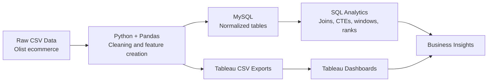

# Customer Retention Intelligence Platform

Portfolio-grade Data Analyst project for customer retention, churn, customer lifetime value, cohort analysis, revenue impact, and BI dashboarding.

## Project Overview

The Customer Retention Intelligence Platform is an end-to-end analytics project built around realistic business intelligence workflows. It uses the provided Olist ecommerce dataset to answer how customers retain, churn, return, and contribute revenue over time.

The project prioritizes analytics and BI over machine learning. It includes normalized MySQL modeling, advanced SQL analysis, Pandas-based data preparation, RFM segmentation, monthly cohort analysis, churn and CLV calculations, Tableau-ready exports, and a professional business insights report.

## Architecture



## Repository Structure

```text
customer-retention-intelligence-platform/
├── data/
│   ├── raw/
│   └── processed/
├── sql/
│   ├── schema.sql
│   ├── load_data.sql
│   └── analytics_queries.sql
├── python/
│   ├── data_cleaning.py
│   ├── cohort_analysis.py
│   ├── churn_analysis.py
│   ├── segmentation.py
│   └── run_pipeline.py
├── tableau/
│   ├── README.md
│   └── exports/
├── reports/
├── dashboard_screenshots/
├── requirements.txt
└── README.md
```

## Dataset Description

The project uses the provided Olist ecommerce dataset:

- Customers: customer IDs, unique customer IDs, city, state, and zip prefix.
- Orders: order status, purchase timestamp, approval, carrier, delivery, and estimated delivery dates.
- Order items: products, sellers, price, freight, and shipping limit dates.
- Products: product category and product attributes.
- Product category translation: Portuguese-to-English category names.

Primary analysis date range: 2016-09-04 to 2018-10-17.

## Database Design

The MySQL model is normalized into four core tables:

- `customers`
- `orders`
- `order_items`
- `products`

Run the SQL layer:

```bash
mysql --local-infile=1 -u root -p < sql/schema.sql
mysql --local-infile=1 -u root -p customer_retention_intelligence < sql/load_data.sql
```

## SQL Techniques Used

The analytics query file demonstrates:

- `INNER JOIN`
- `LEFT JOIN`
- CTEs
- Window functions
- `RANK()`
- `DENSE_RANK()`
- `LAG()`
- Running totals
- Cohort retention queries
- Churn and CLV calculations

See `sql/analytics_queries.sql`.

## Python Analytics Pipeline

Install dependencies:

```bash
pip install -r requirements.txt
```

Run the full pipeline:

```bash
python3 python/run_pipeline.py
```

Generated exports include:

- `data/processed/rfm_segmentation.csv`
- `data/processed/cohort_retention_long.csv`
- `data/processed/churn_by_segment.csv`
- `data/processed/churn_by_region.csv`
- `data/processed/customer_churn_clv.csv`
- `tableau/exports/tableau_*.csv`

## Tableau Dashboards

Build five dashboards from the CSVs in `tableau/exports/`:

1. Executive Overview: Total Customers, Active Customers, Churn Rate, Revenue, CLV.
2. Retention Dashboard: cohort heatmap, retention trends, returning customer rate.
3. Churn Dashboard: churn by segment, churn by region, churn trend.
4. Customer Segmentation Dashboard: RFM analysis, VIP customers, customer distribution.
5. Revenue Impact Dashboard: revenue at risk, CLV by segment, revenue retention.

Screenshot placeholders are documented in `dashboard_screenshots/README.md`.

## Key Business Insights

- Total delivered-order customers: 93,358.
- Active customers under a 180-day churn rule: 38,106.
- Churned customers: 55,252.
- Churn rate: 59.18%.
- Delivered revenue: 13.22M.
- Average historical CLV: 141.62.
- Estimated revenue at risk: 7.51M.
- VIP customers generated 1.78M in revenue with an average CLV of 273.99.
- At Risk customers generated 4.71M in historical revenue and are the highest-priority win-back audience.

Full report: `reports/business_insights_report.md`.

## Resume Bullet Points

- Built an end-to-end customer retention BI platform using Python, Pandas, MySQL, and Tableau-ready exports to analyze churn, CLV, cohorts, and revenue impact across 93K+ ecommerce customers.
- Designed a normalized MySQL schema with customer, order, order item, and product tables, then wrote advanced SQL using joins, CTEs, window functions, `RANK()`, `DENSE_RANK()`, `LAG()`, and running totals.
- Developed RFM segmentation and churn analysis pipelines that classified customers into VIP, Loyal, At Risk, Lost, and Developing tiers for targeted retention strategy.
- Created monthly cohort retention and revenue retention datasets for Tableau heatmaps and executive dashboards.
- Produced business recommendations identifying 7.51M in estimated revenue at risk and prioritizing high-value At Risk customer reactivation.
